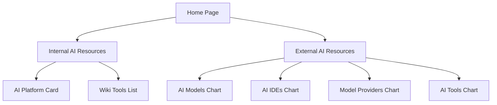

## 1. Product Overview
ABC AI Community is an internal landing page designed to empower colleagues with comprehensive AI tooling resources and knowledge. The platform serves as a centralized hub for both internal organizational AI resources and external AI industry insights, enabling employees to discover, access, and utilize AI technologies effectively.

The product addresses the need for organized AI resource management within enterprises, providing quick access to internal tools while keeping teams updated with the latest external AI developments and trends.

## 2. Core Features

### 2.1 User Roles
This is an internal organizational tool with standard employee access. No complex role differentiation is required for the initial release.

### 2.2 Feature Module
The ABC AI Community consists of the following main pages:
1. **Home page**: Hero section with slogan, AI tech showcase, navigation to resources
2. **Internal AI Resources page**: AI Platform card with Model Garden, Vertex AI Studio, Document Intelligence; Wiki pages list with tools
3. **External AI Resources page**: Four top 10 charts (AI Models, AI IDEs, Model Providers, AI Tools)

### 2.3 Page Details
| Page Name | Module Name | Feature description |
|-----------|-------------|---------------------|
| Home page | Hero section | Display empowering slogan about AI tooling resources and knowledge sharing |
| Home page | AI Tech showcase | Showcase prominent AI technologies with visual elements |
| Home page | Navigation | Provide clear navigation buttons to Internal and External AI Resources |
| Internal AI Resources | AI Platform card | Display Model Garden with list of available AI models |
| Internal AI Resources | Vertex AI Studio | Show link and wiki page information |
| Internal AI Resources | Document Intelligence | Display URL and wiki documentation |
| Internal AI Resources | Wiki tools list | Show organizational tools (AI platform, pomed book, MCP hub) with owner, status, and URL |
| External AI Resources | AI Models chart | Display top 10 latest AI models from SWE-Bee benchmarking |
| External AI Resources | AI IDEs chart | Show top 10 agentic IDEs (Cursor, Trae, VS Code with Copilot) |
| External AI Resources | Model Providers chart | List top 10 model providers (OpenRouter, Together AI, Hugging Face) |
| External AI Resources | AI Tools chart | Display top 10 AI tools (Cloud Code, Open Code) |

## 3. Core Process
Users navigate from the homepage to either internal or external AI resources. The homepage provides a compelling introduction with the organizational slogan and AI technology showcase. From there, users can explore internal company AI tools and platforms, or discover external AI industry trends and top-performing solutions.

## 4. User Interface Design

### 4.1 Design Style
- **Primary colors**: Google Material Design blue (#1976D2) and white
- **Secondary colors**: Material Design grey palette for backgrounds and text
- **Button style**: Material Design raised buttons with ripple effects
- **Font**: Roboto font family with Material Design typography scale
- **Layout style**: Card-based layout with Material Design grid system
- **Icons**: Material Design icons for consistency

### 4.2 Page Design Overview
| Page Name | Module Name | UI Elements |
|-----------|-------------|-------------|
| Home page | Hero section | Large typography slogan, Material Design hero banner with AI-themed background |
| Home page | AI Tech showcase | Material cards displaying AI technologies with icons and brief descriptions |
| Home page | Navigation | Material Design raised buttons with clear labels for Internal/External resources |
| Internal AI Resources | AI Platform card | Material Design card with expandable sections for Model Garden, Vertex AI Studio, Document Intelligence |
| Internal AI Resources | Wiki tools list | Material Design data table with owner, status, and URL columns |
| External AI Resources | Charts | Material Design cards displaying top 10 lists with ranking numbers and brief descriptions |

### 4.3 Responsiveness
Desktop-first design approach with mobile adaptation. The layout will be responsive using Material Design's responsive grid system, ensuring optimal viewing experience across different screen sizes while maintaining touch-friendly interactions for mobile devices.