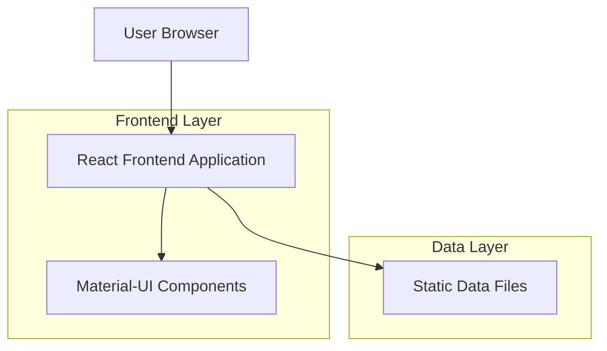
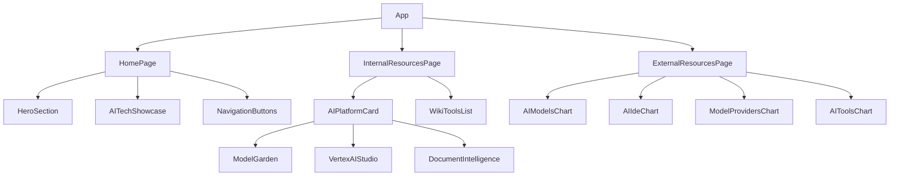

## 1. Architecture design



## 2. Technology Description
- Frontend: React@18 + Material-UI@5 + Vite
- Initialization Tool: vite-init
- Backend: None (Static frontend application)
- Styling: Material-UI components (no Tailwind CSS)

## 3. Route definitions
| Route | Purpose |
|-------|---------|
| / | Home page with slogan and navigation |
| /internal-resources | Internal AI resources page with platform cards and wiki tools |
| /external-resources | External AI resources page with top 10 charts |

## 4. Data Structure Definitions

### 4.1 Internal Resource Types
```typescript
interface InternalTool {
  id: string;
  name: string;
  owner: string;
  status: 'active' | 'beta' | 'maintenance';
  url: string;
  description: string;
}

interface AIPlatformCard {
  modelGarden: AIModel[];
  vertexAIStudio: {
    name: string;
    url: string;
    wikiUrl: string;
  };
  documentIntelligence: {
    name: string;
    url: string;
    wikiUrl: string;
  };
}
```

### 4.2 External Resource Types
```typescript
interface TopChartItem {
  rank: number;
  name: string;
  description: string;
  url?: string;
  category: string;
}

interface ExternalCharts {
  aiModels: TopChartItem[];
  aiIdes: TopChartItem[];
  modelProviders: TopChartItem[];
  aiTools: TopChartItem[];
}
```

## 5. Component Architecture



## 6. Static Data Management
The application uses static JSON files for data storage:
- `/src/data/internal-resources.json` - Internal tools and platform data
- `/src/data/external-charts.json` - Top 10 charts data (hardcoded from research)

Data will be manually updated based on latest AI industry trends and internal organizational changes.